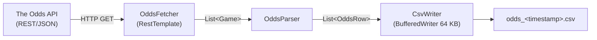
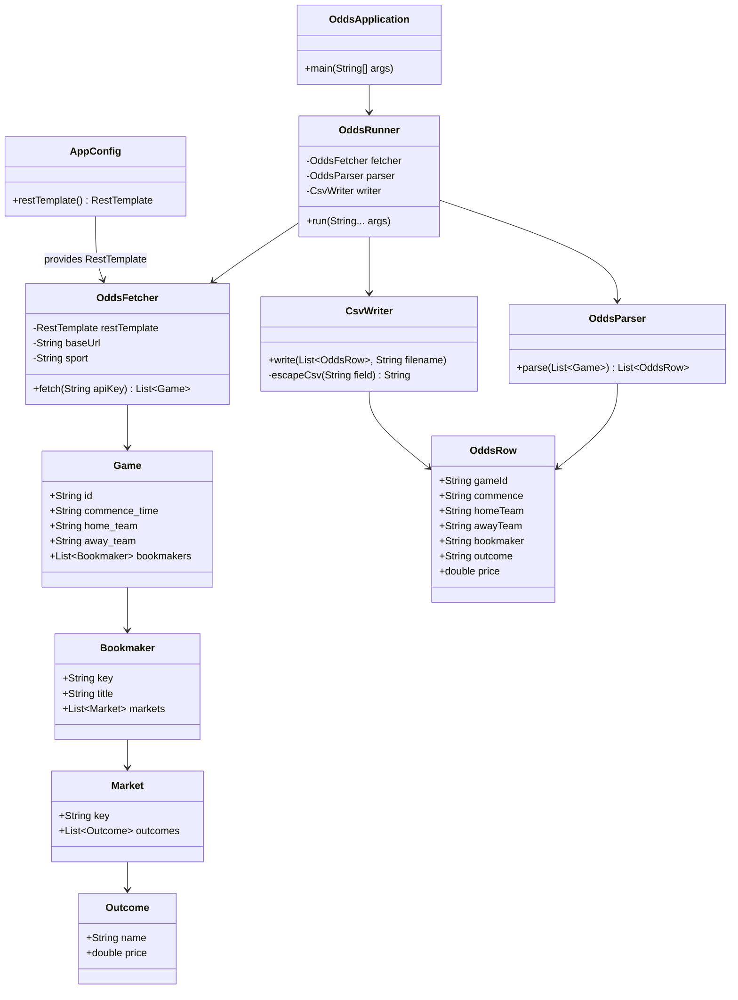
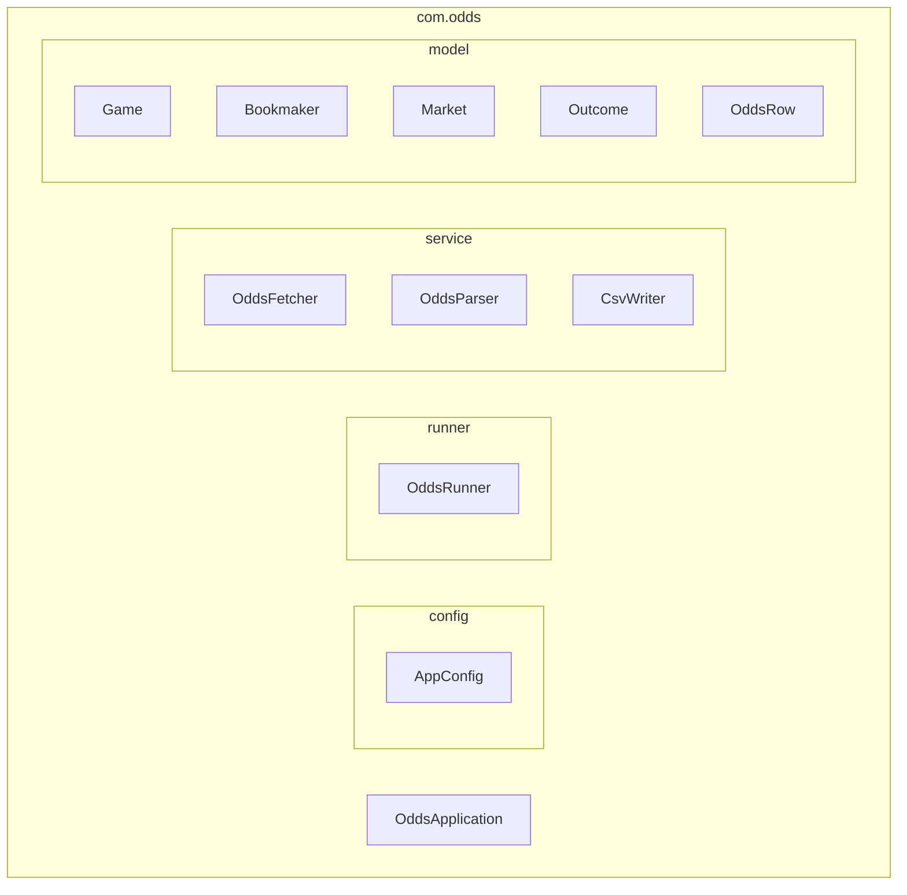
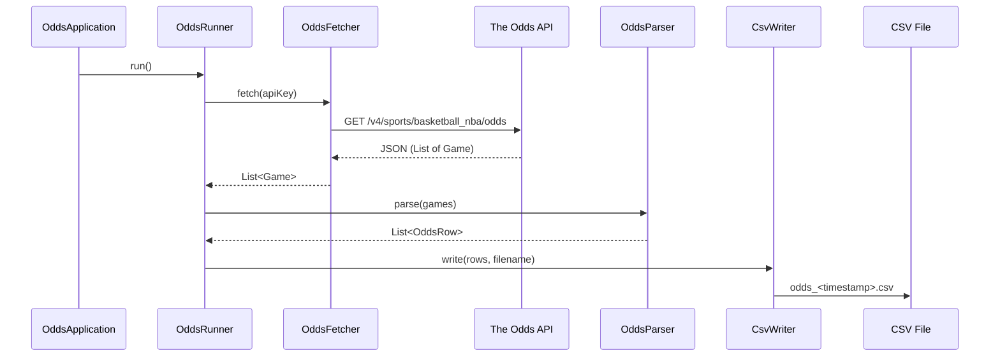

# Architecture

## Overview

NBA Odds Fetcher is a Spring Boot CLI application that fetches live NBA betting odds
from [The Odds API](https://the-odds-api.com/) and exports them to a timestamped CSV file.

The application follows a linear data pipeline: **fetch → parse → write**.

---

## Data Flow

---

## Component Diagram

---

## Package Structure

---

## Sequence Diagram

---

## Technology Stack

| Layer          | Technology                          |
|----------------|-------------------------------------|
| Language       | Java 17                             |
| Framework      | Spring Boot 3.2.5                   |
| HTTP Client    | RestTemplate (Spring Web)           |
| JSON Parsing   | Jackson (via Spring Boot)           |
| CSV Writing    | BufferedWriter (64 KB buffer)       |
| Testing        | JUnit 5 + Mockito + AssertJ         |
| Build          | Maven 3.9+                          |
| Container      | Multi-stage Docker (Maven + JRE 17) |
| CI/CD          | GitHub Actions                      |

---

## CI/CD Pipelines

| Workflow          | Trigger                            | Description                          |
|-------------------|------------------------------------|--------------------------------------|
| `run_tests.yml`   | Push / Pull Request (all branches) | Runs `mvn test` with Maven caching   |
| `fetch_odds.yml`  | Daily 08:00 UTC / Manual dispatch  | Builds, fetches odds, uploads CSV    |
